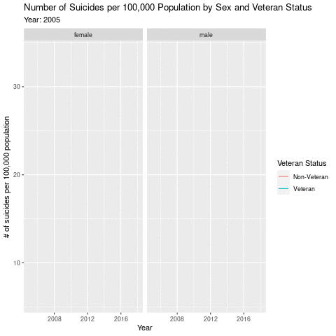
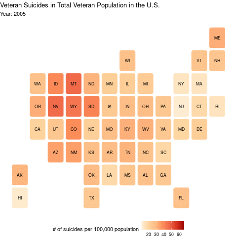

```{r setup, include=FALSE}
knitr::opts_chunk$set(echo = TRUE)
```

```{r include=FALSE}
library(tidyr)
library(ggplot2)
library(readr)
library(dplyr)
library(ggthemes)
library(tidyverse)     # for data cleaning and plotting
library(lubridate)     # for date manipulation
library(openintro)     # for the abbr2state() function
library(palmerpenguins)# for Palmer penguin data
library(maps)          # for map data
library(ggmap)         # for mapping points on maps
library(gplots)        # for col2hex() function
library(RColorBrewer)  # for color palettes
library(sf)            # for working with spatial data
library(leaflet)       # for highly customizable mapping
library(gganimate)     # for adding animation layers to ggplots
library(transformr)    # for "tweening" (gganimate)
#library(gifski)        # need the library for creating gifs but don't need to load each time
library(shiny)         # for creating interactive apps
library(ggrepel)
library(forcats)
library(scales)
library(statebins)
library(patchwork)
```
 
 
# 1. Introduction

The high suicide rates among U.S. veterans compared to the general population have been an ongoing phenomenon home and abroad, and in recent years, statistics record another sharp increase in suicide cases, raising further public concern on the veterans’ physical well-being and mental health issues. According to a report published by the United States Department of Veterans Affairs (VA) in 2020, which analyzed 55 million veterans' records from 1979 to 2018, the current analysis indicates that an average of 17.6 veterans die from suicide per day. In 2018 alone, 6.435 veterans died from suicide. Although this number is already a decrease from the 20 cases/day counted in VA’s 2016 report, this result is partly due to a sharp decrease in total veteran population, the rates of which exceeds the rate of decrease in veteran suicides.

“In each year since 2008, the number of Veteran suicides has exceeded 6,300. 6,435 Veterans died by suicide in 2018, compared with 6,056 in 2005, an increase of 6.3%, despite a decrease in the Veteran population during this time period from 24.5 million to 20.1 million (VA, 2020). “

Although the report also claims that the increase in veteran suicides conforms with the trend that the average suicide cases per year across the nation in the general population since the turn of the millennium, veteran suicide rate remains astonishingly high (an average of 30 cases per 100,000 population) as compared to non-veterans (20.9 for males and 5.2 for females). Unlike other developed countries that also have complete social support systems, American soldiers have been constantly engaging in regional conflicts, anti-terrorism acts and even proxy wars since World War II. Frequent engagement increases the risk for soldiers to be exposed in danger and harsh environments. This has made it more difficult for home mental health services to reach synergies with veterans back from war. 

However, the U.S. has also put intensive efforts at national and local level in response to this difficulty, initiating legislative and unofficial support including veteran benefits and mental health consulting services. The call to raise attention on preventing veteran suicide and depression can be traced back to the 1950s, and veteran care extended further in the 1990s to a national-level strategy during the 1990s, resulting in several advancements in the Legislature to protect veteran welfare. Veteran Health Administration (VHA) was established especially for veterans with mental health problems, providing resources such as free consultation and a 24-hour hotline that aim to mitigate the effect of combat-related guilt and pain, PTSD and depression on veterans. And in order to provide a more specific picture of various social support to veterans, we conducted this study that summarizes the pattern of veteran suicide over the last decade. While the ongoing phenomenon of veteran suicide continues to remind us of the urgency to give broader support, there is also needs for revising and addressing whether past efforts have been effective.  Doing so will enable us to keep giving informative suggestions on future suicide prevention. Thus, in this project, we use visualizations and data analysis to show some suicide-related statistics on veterans and examine demographic factors within the veteran population that may reflect further needs. 

 
```{r include=FALSE}
# read data
vet_deaths_sex_age_2005_2018 <- read_csv("data/vet_deaths_sex_age_2005_2018.csv")
nonvet_deaths_sex_age_2005_2018 <- read_csv("data/nonvet_deaths_sex_age_2005_2018.csv")


pop_deaths_state_age_2005_2018 <- read_csv("data/pop_deaths_state_age_2005_2018.csv")
pop_deaths_state_method_2005_2018 <- read_csv("data/pop_deaths_state_method_2005_2018.csv")
```


# 2 Research Question

**How are veteran suicide statistics associated with demographic factors, such as geography, gender, and age? **

```{r include=FALSE}
# data cleaning: veteran suicides by age, sex  (as compare to non-veteran)
# usage: for general veteran suicides plots
nonvet_total <- nonvet_deaths_sex_age_2005_2018 %>% 
  select(-nonvet_rate, -nonvet_deaths, -nonvet_pop, -male_nonvet_rate, -female_nonvet_rate) %>% 
  mutate(age = ifelse(age_2 == "." | age_2=="55", "55+", age_2)) %>% 
  mutate(female_nonvet_deaths = as.numeric(gsub(",","",ifelse(female_nonvet_deaths==".", "0",female_nonvet_deaths)))) %>% 
  mutate(female_nonvet_pop = as.numeric(gsub(",","",ifelse(female_nonvet_pop==".", "0",female_nonvet_pop)))) %>% 
  select(-c(age_1, age_2)) %>% 
  group_by(Year, age) %>% 
  summarise_all(.funs = sum) %>% 
  #mutate(nonvet_rate = nonvet_deaths*100000/nonvet_pop) %>% 
  mutate(male_nonvet_rate = male_nonvet_deaths*100000/male_nonvet_pop) %>% 
  mutate(female_nonvet_rate = female_nonvet_deaths*100000/female_nonvet_pop) %>% 
  filter(age!="Total")

vet_total <- vet_deaths_sex_age_2005_2018 %>% 
  select(-vet_rate,-vet_deaths, -vet_pop, -male_vet_rate, -female_vet_rate) %>% 
  mutate(age = ifelse(age_2 == "." | age_2=="55", "55+", age_2)) %>% 
  mutate(female_vet_deaths = as.numeric(gsub(",","",ifelse(female_vet_deaths==".", "0",female_vet_deaths)))) %>% 
  mutate(female_vet_pop = as.numeric(gsub(",","",ifelse(female_vet_pop==".", "0",female_vet_pop)))) %>% 
  select(-c(age_1, age_2)) %>% 
  group_by(Year, age) %>% 
  summarise_all(.funs = sum) %>% 
  #mutate(vet_rate = vet_deaths*100000/vet_pop) %>% 
  mutate(male_vet_rate = male_vet_deaths*100000/male_vet_pop) %>% 
  mutate(female_vet_rate = female_vet_deaths*100000/female_vet_pop) %>% 
  filter(age!="Total")


pop_deaths_sex_age_2005_2018 <- nonvet_total %>% 
  left_join(vet_total) %>% 
  pivot_longer(
    cols = -c(Year,age),
    names_to = c("sex", "group", "benchmark"),
    names_pattern = "(.*)_(.*)_(.*)",
    values_to = "value"
  ) %>% 
  pivot_wider(
    id_cols = c(Year, age, sex, group),
    names_from = benchmark,
    values_from = value
  ) %>% 
  mutate(group=ifelse(group=="nonvet", "Non-Veteran", "Veteran"))

pop_deaths_sex_age_2005_2018
```


```{r include=FALSE}
# data cleaning: veteran suicide by state (region)!!
# usage: for drawing maps
pop_deaths_state_age <- pop_deaths_state_age_2005_2018 %>% 
  filter(age=="Total" & state!="All" & state!= "Total U.S.") %>% 
  select(-age) %>% 
  mutate(vet_deaths=as.numeric(vet_deaths)) %>% 
  mutate(vet_rate=ifelse(grepl("*", vet_rate, fixed = TRUE), substr(vet_rate, 1, nchar(vet_rate)-1), vet_rate)) %>% 
  mutate(vet_rate=as.numeric(vet_rate)) %>% 
  mutate(pop_deaths=as.numeric(pop_deaths)) %>% 
  mutate(pop_rate=as.numeric(pop_rate)) %>% 
  filter(!is.na(vet_rate)) %>% 
  mutate(Year=as.integer(Year))
  #mutate(state=tolower(state))

pop_deaths_state_age
```

```{r include=FALSE}
# data cleaning: veteran suicides by methods (as compare to general population)
# usage: for general veteran suicides plots
pop_deaths_state_method <- pop_deaths_state_method_2005_2018 %>% 
  filter(state!="All" & state!= "Total U.S.") %>% 
  mutate(group=ifelse(group=="Veteran Method", "Veteran", "Population")) %>% 
  mutate(deaths=as.numeric(deaths)) 

pop_deaths_state_method
```


# 3 Data

We obtain our suicides rate statistics from the official website of U.S. Department of Veterans Affairs (VA). VA collects information of active soldiers and veteran members and began releasing annual reports of veteran suicide prevention since 2016, when it completed the compilation of a large, up-to-date analysis of past data. Demographic and state-level data are also available in the form of .csv for download.

# 4 Results and Analysis

## 4.1 Demographic Statistics

```{r echo=FALSE}
#Figure 1
p1 <- vet_deaths_sex_age_2005_2018 %>%
  filter(age_1 == "Total") %>%
  ggplot(aes(x = Year, y = vet_deaths)) +
  geom_line(color = "blue")+
  geom_point()+
  labs(title = "Number of Veteran Suicides", y = "Cases", subtitle = "from 2005-2018")

p2 <- nonvet_deaths_sex_age_2005_2018 %>%
  filter(age_1 == "Total") %>%
  ggplot(aes(x = Year, y = nonvet_deaths)) +
  geom_line(color = "blue")+
  geom_point()+
  labs(title = "Number of Non-Veteran Suicides", y = "Cases", subtitle = "from 2005-2018", caption = "Graph 1")

p1 + p2
```

First, we look at the statistics on veteran and non-veteran suicides across our selected time range for the sake of comparison. Graph 1 summarizes the total number of veteran and non-veteran suicide cases from 2005 to 2018. As the graph have shown, there is an astonishing increase in non-veteran suicides from 2005 to 2018, with the number of cases increasing by almost 60%. In contrast, the annual number of veteran suicides increased slightly from 6000 in 2005 to 6500 in 2008, and has remained stable since. 40075 civilians died from suicide in 2018, as compared to 6435 in veterans. At least from the numbers, we know that the percentage veterans occupy in veteran suicide cases in the total population has been decreasing. Undeniably, the number of cases still suffers from an increase.

## 4.2 Age and Gender Adjusted Veteran Suicides

```{r echo=FALSE}
# figure 2: 
pop_deaths_sex_age_2005_2018 %>% 
  ggplot(aes(x=age, y=deaths, fill=group))+
    geom_col(position = "dodge")+
    facet_wrap(~sex)+
    labs(title = "Number of Suicides by Age Group, Sex and Veteran Status", x = "Age Group", y = "# of suicides",fill="Veteran Status")
```

Next, we look at some statistics that shows the demographic pattern of suicides. The figure above exhibits the number of suicide cases by age, sex, and veteran status. In terms of gender, we notice that males commit much larger suicides than females for all age groups and populations. The contrast between male and female in suicide rates is obvious among non-veterans, with cases of male suicides almost three times as those of female. However, this contrast is even more obvious among veterans, with female suicides down by multiple times. The reason behind this contrast is primarily because of the absolute advantage of male over female serving in military. Male veterans are also more likely to be exposed to extreme dangers during combats because of their job characteristics, while females primarily serve supporting roles, such as military logistics. 

Veterans and non-vets exhibit distinctive traits in terms of ages of suicides. Among non-veterans, there is not a significant difference in the number of cases within each age group. Non-veterans commited more suicides after they are 35 compared to when they are 18-34. Fewer female non-vets commit suicides when they are 18-34 compared to other age groups than male, but the gender difference is not obvious. For veterans, however, there is a gender difference in terms of age. There are similar numbers of cases among female veterans for each age group, but in males, the number of suicides increases drastically as age increases. To understand this pattern, we also need to understand the social context behind. Older veterans, for example, may be more exposed to mental as well as physical difficulties than younger generations. They usually served when the domestic anti-war movement was at it peak, and thus might be easier to experience PTSD because of their reflection on either their combat experience or psychological guilt. Physically, older veterans are also more vulnerable to suffering from isolation from the society, because a lack of support to veterans right after they retired impeded their steps toward higher education, stable or reliable income, or even transition towards normal lives. 

 
```{r message=FALSE , echo=FALSE}
# Figure 3:
vet_rate_time_sex <- pop_deaths_sex_age_2005_2018 %>% 
  group_by(Year, sex, group) %>% 
  summarise(deaths=sum(deaths), pop=sum(pop)) %>% 
  mutate(rate=deaths*100000/pop) %>% 
  ggplot(aes(x=Year, y= rate, color=group))+
    geom_line()+
    facet_wrap(~sex)+
    labs(title = "Number of Suicides per 100,000 Population by Sex and Veteran Status", y="# of suicides per 100,000 population", color="Veteran Status", subtitle = "Year: {frame_along}")+
    transition_reveal(Year)

animate(vet_rate_time_sex, nframes = 14, duration = 7)
```

```{r eval=FALSE, echo=FALSE}
anim_save("vet_rate_time_sex.gif")
```

```{r, eval = FALSE, echo=FALSE}

```

Just by looking at total number of cases in each category is not enough, though, as the population of veterans and U.S. citizens is shifting dynamically, For example, the total veteran population decreased by 18% from 2005 to 2018. Therefore, we made another visualization that shows the number of suicides by veteran status and gender, using per 100,000 population metrics. For female veterans, the number of cases per 100,000 people increases from 10 to 15, and male veteran suicides increase from 25 to 35 cases. This is a shocking statistic, as the gap of increase in veteran suicides is actually wider than that in non-vet suicides. Contrary to what we have seen in the statistics of total cases, we observe a sharp increasing trend in veteran suicides from 2005 to 2018, regardless of gender. This confirms our assumptions that a stability of total cases in recent years cannot be representative of the hidden trend, and just looking at total counts can even be deceptive. 


## 4.3 State Level Trend

State-level veteran suicide results are displayed in the following section.

```{r, eval = FALSE, echo = FALSE}
# Figure 4:
states_map <- map_data("state")

pop_deaths_state_age %>%
  filter(Year == "2018") %>%
  mutate(state = str_to_lower(state)) %>%
  ggplot(aes()) +
  geom_map(aes(map_id = state, 
               fill = vet_rate), 
           map = states_map,
           color="white")+
  expand_limits(x = states_map$long, y = states_map$lat)+
  scale_fill_gradient2()+
  theme_map()+
  theme(legend.background =  element_blank(), legend.position = "right" )+
  labs(title = "Percentage of Veteran Suicides in Total Veteran Population in the U.S. in 2018", fill = "# of suicides per 100,000 population")
```

Intuitively, the number of total veteran suicides in each state must conform with the population level of each state, which means that larger states such as California, Florida and Texas should have more veteran populations, as well as veteran suicides in total. If we are going to look into density of suicides, however, the cumulative statistics is also deceptive in this case. Again, we use fractional results to analyze our geographical trend. From this graph, we can observe that the density of veteran suicides does not follow the pattern of total populations. In fact, states with denser (often more) populations are lower in terms of suicide as a fraction of total population. The state with the most suicide cases is Montana, with over 60 veterans per 100,000 population commiting suicide solely in 2018. Most other Central and Mountain states (Nevada, Oregon, New Mexico, Wyoming) also have high concentrations. States with lower statistics usually concentrate in the Midwest and along the Rust Belt (Minnesota, Illinois, Pennsylvania, etc.).

```{r echo=FALSE}
# Figure 5:
states_map <- map_data("state")

pop_deaths_state_age %>%
  filter(Year %in% c("2018", "2005", "2010", "2015")) %>%
  mutate(state = str_to_lower(state)) %>%
  ggplot(aes()) +
  geom_map(aes(map_id = state, 
               fill = vet_rate), 
           map = states_map,
           color="white")+
  expand_limits(x = states_map$long, y = states_map$lat)+
  facet_wrap(~ Year)+
  scale_fill_gradient2()+
  theme_map()+
  theme(legend.background =  element_blank(), legend.position = "right")+
  labs(title = "Percentage of Veteran Suicides in Total Veteran Population in the U.S.", fill = "# of suicides per 100,000 population")
```

This graph exhibits the number of suicides per 100,000 population for continental U.S. across selected years.we could observe that the general density of color in maps becomes darker as time passes, which indicates that the overall suicide rate in the U.S. keeps increasing in the past decade. In 2005, for every 100,000 people, almost all the states had less than 30 people committing suicide. However, in 2018, about all of the states exceeded that number. 

```{r eval=FALSE, echo=FALSE}
# Figure 6:
gif <- pop_deaths_state_age %>%
  ggplot(aes(state=state, fill=vet_rate))+
  geom_statebins()+
  theme_void()+
  scale_fill_distiller(palette = "OrRd",direction = 1)+
  labs(title = "Veteran Suicides in Total Veteran Population in the U.S.", fill = "# of suicides per 100,000 population", subtitle = "Year: {frame_time}")+
  theme(legend.position="bottom")+
  transition_time(Year)
  #ease_aes("linear")

animate(gif, nframes = 14, duration = 28)
```

```{r eval=FALSE, echo=FALSE}
anim_save("time_vet_rate.gif")
```

```{r, echo=FALSE}

```
 
We can observe the results over time more specifically and straightforward through this animation. It is clear that Mountain states have apparently higher suicide rates compared to other regions in the U.S.. This result makes sense both in terms of veterans' living conditions and of public support. States with lower population density usually have fewer job opportunities and may have less funding and organizations available for veteran support. Although congressional resolutions over the past few years mandated that a decent amount of federal funding must be provided to support comprehensive programs including outreach at VA offices in each state, certain states still suffer from a lack of budget. A lack of workforce or a sparse distribution of populations in these states can also cause a shortage of public and private veteran services, as more resources must be put in order to keep the communication and surveillance of veterans.

## 4.4 Other Relevant Information & Analysis

```{r echo = FALSE, message=FALSE}
# figure 5:
pop_deaths_state_method %>% 
  mutate(deaths=ifelse(is.na(deaths), 0, deaths)) %>% 
  group_by(group, method) %>% 
  summarise(deaths=sum(deaths)) %>% 
  mutate(prop=deaths/sum(deaths)) %>% 
  mutate(ymax=cumsum(prop)) %>% 
  mutate(ymin=c(0, head(ymax, n=-1))) %>% 
  mutate(pos= (ymax+ymin)/2) %>% 
  mutate(label=percent(prop)) %>% 
  ggplot(aes(ymax=ymax, ymin=ymin, xmax=4, xmin=3, fill=method)) +
    geom_rect()+
    coord_polar(theta="y") +
    geom_text( x=2, aes(y=pos, label=label, color=method), size=3) +
    xlim(c(-1, 4)) +
    facet_wrap(~group)+
    theme_void()+
    labs(title = "Suicide Methods Comparison: Veteran vs. General Population", y = "", x="")
```

Other information we can retrieve from our dataset includes the distribution of suicide methods. We can see that compared to the general population, veterans choose to use firearms to commit suicide at a much higher rate - 65.02%. In contrast, they use less suffocation and poisoning. This phenomenon can be explained by the fact that veterans have more experience with firearms, and they also have much higher possibility of owning a firearm than the rest of the population. 


# 5 Conclusion

In the most recent annual report release, VA concludes: "Suicide prevention has evolved in meaningful and significant ways within a relatively brief period." Optimistically speaking, veteran rights are being increasingly valued, and more and more measures have been taken in order to provide more accessible and practical help to veterans encountering mental issues. Our project, however, suggests a different, warning picture. Despite all the efforts, the level of veteran suicides remains high, and veteran suicide rates have been increasing sharply in recent years. Geographically, there is an uneven distribution of suicide rates across different states and regions, and this phenomenon is exacerbating. While it is definitely the responsibility of the government to address the importance of veteran care, but equally important is the necessity to revise past strategies and improve the effectiveness and precision of public policies. 


# 6 References

1. Suicide Data Report, 2020. Department of Veterans Affairs, Mental Health Services, Suicide Prevention Program. https://www.mentalhealth.va.gov/docs/data-sheets/2020/2020-National-Veteran-Suicide-Prevention-Annual-Report-11-2020-508.pdf

2. National Veteran Suicide Data and Reporting. Department of Veterans Affairs, Mental Health Services, Suicide Prevention Program. https://www.mentalhealth.va.gov/suicide_prevention/data.asp 

3. State-level Veteran Suicide Data and Reporting. Department of Veterans Affairs, Mental Health Services, Suicide Prevention Program. https://www.mentalhealth.va.gov/suicide_prevention/data.asp 
